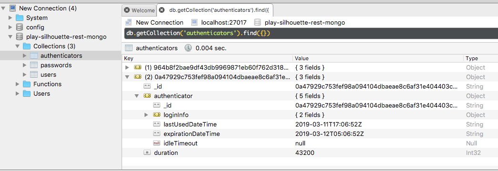

# Database

## Create the DB using a docker container

Note: only works with Mongo 3.6


```
$ docker run --name some-mongo --publish 27017:27017 --detach mongo:3.6
```


## Install the database using scripts

```
$ sh docker-recreate.sh
```


## remove the container

```
$ docker rm -f some-mongo
```

## Expected Result


